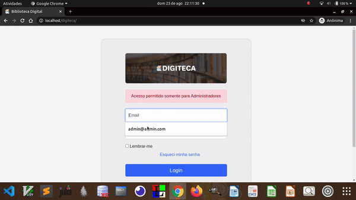

# Projeto de biblioteca virtual
Um programa para gerenciamento de livros em uma biblioteca física.



Este projeto foi feito como trabalho para a disciplina de Programação de Scripts, sendo um projeto destinado ao nosso aprendizado. Não nos responsabilizamos por problemas, bugs ou qualquer coisa que esse projeto possa lhe causar.

## Tópicos   

- [Introdução](#Introdução)   
- [Preparando o ambiente](#Preparando-o-ambiente)   
- [Acessando o programa](#Acessando-o-programa)   
- [Aviso](#Aviso)   


### Introdução
Este é um programa para gerenciamento de livros, usuários e empréstimos para bibliotecas físicas. Segue um gif demonstrativo do programa.

### Preparando o ambiente  

1. Primeiramente é necessário instalar o lamp, clique [https://bitnami.com/stack/lamp/installer](aqui), baixe, instale e deixe-o pronto de acordo com seu sistema operacional.  
2. Depois você precisa abrir o lamp e iniciar o *Apache Web Server* e o "MySQL Database".  
3. Agora as coisas podem ser um pouco diferentes. Se você está acostumado a usar o git, continue, caso contrário, vá para o passo 6.  
4. Basta clonar o repositório "https://github.com/gabrielogregorio/digiteca" dentro da pasta "htdocs" do lamp.  
Exemplo no ubuntu:  

```shell
# Acessar a pasta
cd /opt/lampp/htdocs

# clonar o repositório
git clone https://github.com/gabrielogregorio/digiteca
```

5. Agora basta ir para o passo 11.  
6. No seu navegador, acesse o repositório https://github.com/gabrielogregorio/digiteca  
7. Clique no botão verde escrito "code"  
8. Clique em "download zip". Um arquivo .zip será baixado para o seu computador.  
9. Extraia o arquivo baixado, você terá uma pasta chamada "digiteca".  
10. Mova a pasta "digiteca" para o "htdocs" do lamp.  
> Desta forma, dentro da pasta "htdocs" do lamp teremos a pasta "digiteca".   
11. Agora abra *PHP My Admin* no seguinte endereço http://localhost/phpmyadmin/  
12. Clique em "Novo"  
13. Crie um banco de dados chamado exatamente "digiteca"  
14. Clique no botão "Importar".  
15. Clique em "Escolher arquivo"  
16. Selecione o arquivo "digiteca.sql".   
> Este arquivo está dentro da pasta "sql", dentro da "digiteca" que você colocou em "htdocs"  
17. Após escolher o arquivo, clique em "Executar".  
> Os dados e as tabelas serão importados para o banco digiteca que você criou anteriormente.  

Agora sim, a biblioteca já está pronta para ser usada.  

### Acessando o programa
Acesse o endereço (http://localhost/digiteca/)[http://localhost/digiteca/] e a tela da biblioteca será carregada.  

Como demonstração, deixamos o e-mail como "admin@admin.com" e a senha como "admin".  
Basta preencher as credenciais e clicar em login.  

#### Aviso    
Como demonstração, deixamos alguns dados cadastrados. Para excluir um usuário por exemplo, primeiro remova todos os empréstimos deste usuário.  


